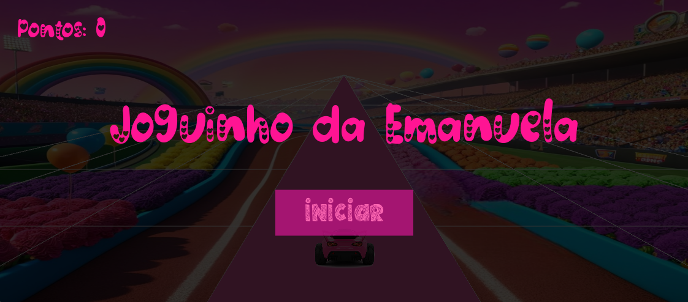
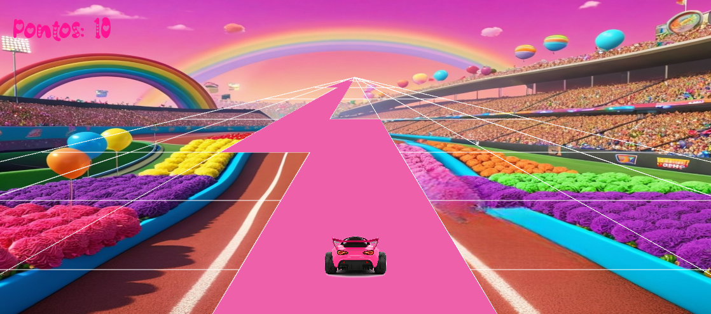
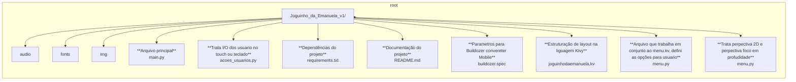

# :video_game: Jogo Personalizado para Minha Filha
Este é um jogo especial desenvolvido em Python usando o Framework Kivy e a biblioteca interna do python radom, e a ferramenta buildozer. 
O projeto foi criado como um presente para minha filha, proporcionando uma experiência divertida e educativa.

O desenvolvimento foi inspirado no tutorial do programador Sr. Jonathan, publicado no canal do YouTube freeCodeCamp.org. 
Você pode conferir o tutorial completo neste link: [Tutorial do Jogo Galaxy.](https://www.youtube.com/watch?v=l8Imtec4ReQ&list=PLIfnysyBPjWyDvEihlxPeNsTGhbp1NrzR&index=4)


# 🚀 Tecnologias Utilizadas
- **Python**
- **Kivy** (Interface gráfica)
- **radom**
- **Outros Ferramentas:**
  - **Buildozer** (Ferrameta de empacotar aplicativos para executarem em plataformas mobile)
 
# 🎲 Como Jogar
## 1. Clone o repositório:
```bash
git clone https://github.com/zantech-pro/joguinho_da_emanuela.git
```
## 2. Criar e Ativar um Ambiente Virtual (Opcional, mas recomendado)
```bash
python -m venv venv
source venv/bin/activate  # No Windows: venv\Scripts\activate
```
## 3. Instale as dependências:
```bash
pip install -r requirements.txt
```
## 4. Execute o jogo:
```bash
python main.py
```
# 🖥️ Capturas de Tela





# Estrutura do Projeto

📌 Funcionalidades
✅ Interface interativa e amigável
✅ Mecânica divertida e educativa
✅ Totalmente personalizado

📜 Licença
Este projeto foi feito com carinho e é de uso pessoal. Caso tenha interesse, entre em contato!

Meu telegram: [@zandermais](https://t.me/zandermais)

📧: dev@zantech.com.br


